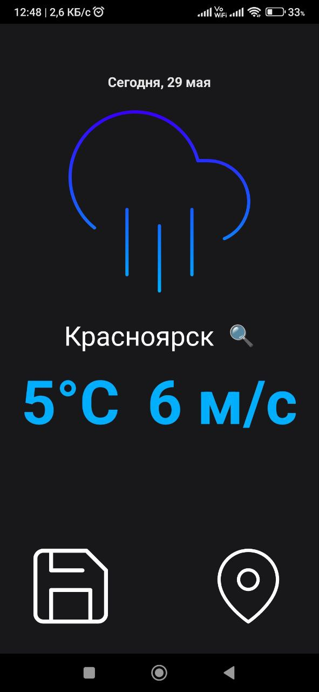
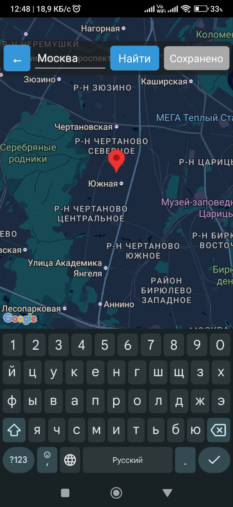
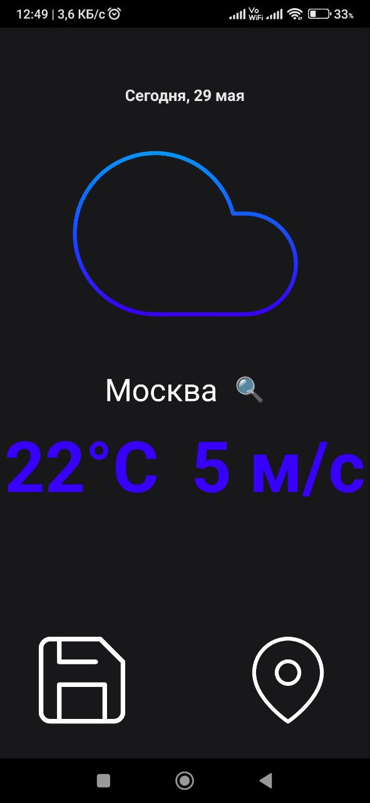
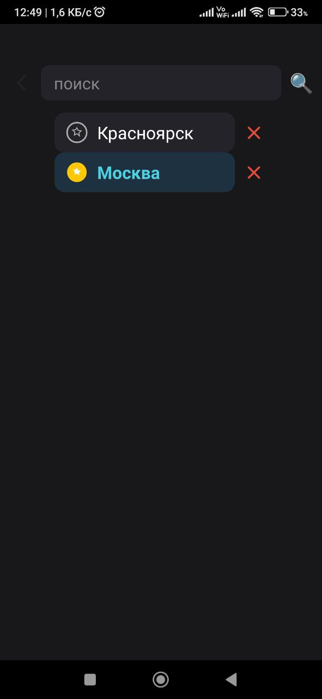
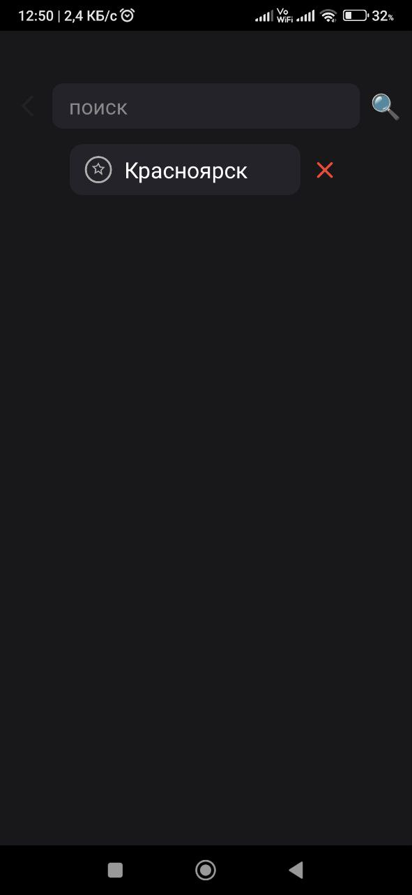

# Weather App

## Сборка и запуск проекта

### 1. Клонирование репозитория

```bash
git clone https://github.com/Nurdoolota/weather-app.git
cd weather
```

### 2. Установка зависимостей

```bash
npm install
```

### 3. Запуск проекта

##### Android:
```bash
npm run android
```

### 4. Создание apk файла
Перейти в папку android:
```bash
cd android
```

выполнить команду
```bash
gradlew.bat assembleRelease
```
"
в директории "android\app\build\outputs\apk\release" создастся apk файл коротую можно запускать непосредственно в самом android устройстве

## О приложении
Приложение позволяет узнавать актуальную погоду в выбранных городах

## Руководство для пользователя

### Главный экран
 - Просмотр подробной погоды



### 2. Добавление города в избранное
- Перейдите в карты в поиске введите город
- После ввода нажмите на "Найти" 
- Нажмите кнопку **«Сохранить»**.
- Город добавится в ваш список избранных городов.




### 3. Просмотр прогноза погоды
- Перейдите в созраненные города
- Выберите город
- После выбора города вы увидите подробный прогноз погоды 



### 4. Переключение между сохранёнными городами

- Откройтесписок городов (иконка списка).
- Выберите нужный город — прогноз сразу обновится.



### 5. Удаление города из избранного

- В списке сохранённых городов удалите нажатием на крест "Х"


